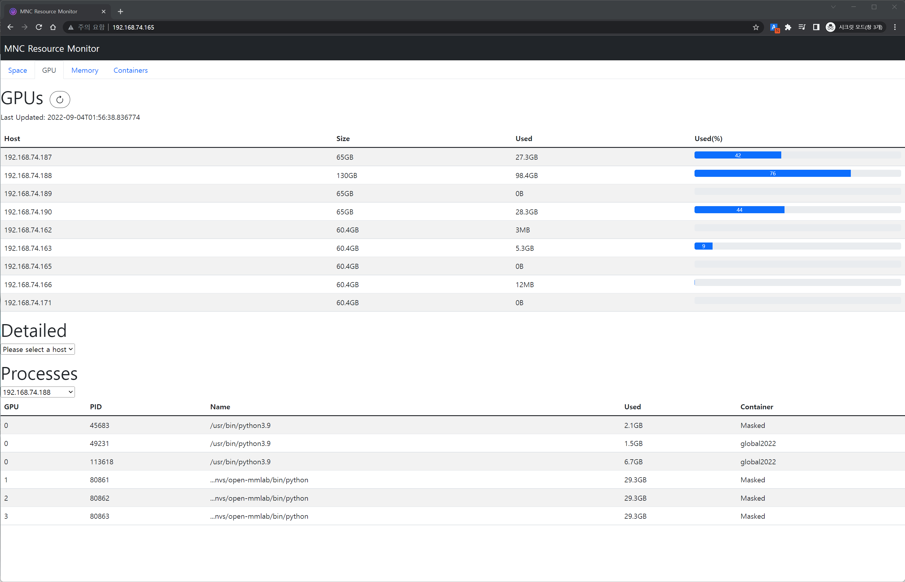
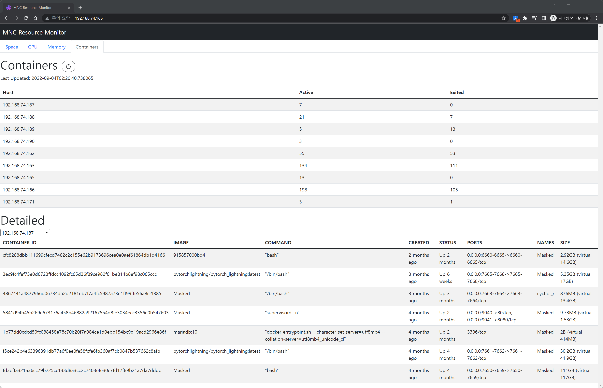

# Resource-Monitor


<p align="center">
    
    
</p>

## Get the source
```
git clone https://github.com/kangsan0420/Resource-Monitor
cd Resource-Monitor
```

## Build the image
```
docker build -t resource_monitor:v1.0 .
```

## Set your ssh configuration 
```
vi server_ids.conf
```

## Run with docker
```
docker run -d -v ${PWD}/server_ids.conf:/app/config/server_ids.conf -e TZ=Asia/Seoul -e HOST_ADDR=http://192.168.74.171 -e PORT_BACK=8080 -p 80:80 -p 8080:8080 --name kslee_resource-monitor resource_monitor:v1.0
```
